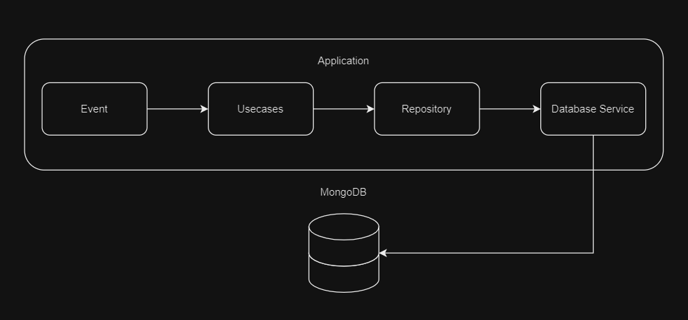

# Golang MongoDB CRUD
Implementação de integração e um CRUD (create, read, update, delete) entre uma aplicação Golang e um banco de dados NoSQL (não relacional) MongoDB orientado a documentos.

## Conceitos e Design Patterns Utilizados
* Entities
* Repository
* Adapters
* Singleton

### Conexão com Banco de Dados e Singleton
A conexão com o banco de dados foi abstraída como um serviço, onde ele é utilizado apenas para criar o client de comunicação entre a aplicação e o banco, onde o client é utilizado como um singleton, ou seja, sua instancia será utilizada por toda a aplicação, mantendo assim apenas uma conexão com o banco de dados, economizando recursos de máquina.

<details>
    <summary>Implementação</summary>

```go
package adapters

import (
	"context"
	"fmt"
	"strconv"

	"go.mongodb.org/mongo-driver/mongo"
	"go.mongodb.org/mongo-driver/mongo/options"
)
// struct do banco com as credenciais
type MongoDb struct {
	host     string
	port     int
	user     string
	password string
	database string
}

// interface que define os métodos a serem implemntados
type IMongoDB interface {
    // apenas o método de conexão
	Connect()
}

// varável global utilizada como singleton
var Database *mongo.Database

// implementação do método
func (m *MongoDb) Connect() {
    // se já não houver uma instancia uma deverá ser criada
	if Database == nil {
        // instanciando credenciais, geralmente alocado em um arquivo de configuração .env ou yaml
		credentials := &MongoDb{
			user:     "<user>",
			password: "<password>",
			database: "<>database name",
			port:     27017,
			host:     "<host>",
		}

        // string de conexão
		uri := fmt.Sprintf("mongodb://%s:%s@%s:%s/", credentials.user, credentials.password, credentials.host, strconv.Itoa(credentials.port))

        // configurações do client
		serverAPI := options.ServerAPI(options.ServerAPIVersion1)
		opts := options.Client().ApplyURI(uri).SetServerAPIOptions(serverAPI)

		ctx := context.TODO()
		client, err := mongo.Connect(ctx, opts)

		if err != nil {
			fmt.Println("URI:", uri)
			panic(err)
		}

		pingErr := client.Ping(ctx, nil)

		if pingErr != nil {
			fmt.Println("PING ERROR:", pingErr.Error())
			panic(err)
		}

		Database = client.Database(credentials.database)

		fmt.Println("DATABASE CONNECTION SUCCESS!")
	}
}

```
</details>

### Operações Abstratas do Banco de Dados
As operações básicas utilizadas nas aplicações geralmente são simples de implementar, no entanto visando simplificar ainda mais a utilização dos recursos oferecidos pelo driver do banco de dados, e visando um código limpo, foi desenvolvido uma abstração dessas operações, tornando mais fácil e claro as operações, e isolando a execução das operações de outros módulos do projeto.
<details>
    <summary>Implementação</summary>

```go
package adapters

import (
	"context"

	"go.mongodb.org/mongo-driver/mongo"
)

type MongoOperations struct{}

// métodos a serem implementados
type IOperations interface {
	Insert(ctx context.Context, collection string, value interface{}) (*mongo.InsertOneResult, error)
	Find(ctx context.Context, collection string, filters interface{}, value interface{}) error
	Update(ctx context.Context, collection string, filters interface{}, value interface{}) (*mongo.UpdateResult, error)
	Delete(ctx context.Context, collection string, filters interface{}) (*mongo.DeleteResult, error)
}

// OBS: o tipo interface{} utilizados nos parametros e varaveis da aplicação são utilizados como tipos genéricos em Golang

func (o *MongoOperations) Insert(ctx context.Context, collection string, value interface{}) (*mongo.InsertOneResult, error) {
	result, err := Database.Collection(collection).InsertOne(ctx, value)
	return result, err
}

func (o *MongoOperations) Find(ctx context.Context, collection string, filter interface{}, value interface{}) error {

	cursor, err := Database.Collection(collection).Find(ctx, filter)

	if err != nil {
		return err
	}

	return cursor.All(ctx, value)
}

func (o *MongoOperations) Update(ctx context.Context, collection string, filter interface{}, value interface{}) (*mongo.UpdateResult, error) {
	result, err := Database.Collection(collection).UpdateOne(ctx, filter, value)
	return result, err
}

func (o *MongoOperations) Delete(ctx context.Context, collection string, filter interface{}) (*mongo.DeleteResult, error) {
	result, err := Database.Collection(collection).DeleteOne(ctx, filter)
	return result, err
}

```
</details>

### Entidade
A struct em questão trás um exemplo sobre como podemos trabalhar com entidades e arquivos que serão armazenados em nosso banco de dados MongoDB, utilizando a flag *bson* para que o dado seja aceitável para o banco de dados.

<details>
    <summary>Implementação</summary>

```go
package entities

import "go.mongodb.org/mongo-driver/bson/primitive"

// OBSs:
//      O tipo primitive.ObjectID é usado para definir que o id da struct será gerado pelo próprio banco
//      A flag bson é usado para representar e identificar cada valor no arquivo salvo pelo banco
type Report struct {
    // definindo que o id da struct será gerado pelo proprio banco
	Id          primitive.ObjectID `bson:"_id"`
	Title       string             `bson:"Title"`
	Content     string             `bson:"Content"`
	Responsible string             `bson:"Responsible"`
}
```

</details>

### Repositório
O repositório é a ponte entre as regras de negócio ou operações a serem realizadas e o banco de dados, onde ele é responsável por receber as intruções de busca, criação, atualização ou remoção de valores persistidos no banco s de dados, recebendo possíveis filtros, e concentrando a complexidade de entender o que uma regra de negócio pede, e o que um banco de dados entende, assim trazendo os dados de maneira concisa e removendo a complexidade e poluição de código da regra de negócio.

<details>
    <summary>Implementação</summary>

```go
package repository

import (
	"context"
	"fmt"
	"go_mongo_db/internal/entities"
	"go_mongo_db/internal/adapters"

	"go.mongodb.org/mongo-driver/bson"
	"go.mongodb.org/mongo-driver/bson/primitive"
)

type ReportRepository struct{}

// parametros aceitavels como filtro nas operações
type ReportParams struct {
	Id          primitive.ObjectID `bson:"_id"`
	Responsible string             `bson:"Responsible"`
}

// collection a ser utilizada
const reportCollection string = "Report"

// métodos a serem implementados
type IReportRepository interface {
	Create(report entities.Report) error
	Find(filter *ReportParams) (*[]entities.Report, error)
	Update(id primitive.ObjectID, value entities.Report) error
	Delete(id primitive.ObjectID) error
	handleFilter(params *ReportParams) bson.M
	handleSet(params *entities.Report) bson.M
}

func (r *ReportRepository) Create(report entities.Report) error {
	database := &adapters.MongoOperations{}
	ctx := context.TODO()

	report.Id = primitive.NewObjectID()

	_, err := database.Insert(ctx, reportCollection, report)

	if err != nil {
		fmt.Println("INSERT ERROR")
	}

	return err
}

func (r *ReportRepository) Find(params *ReportParams) (*[]entities.Report, error) {
	database := &adapters.MongoOperations{}
	ctx := context.TODO()

	values := []entities.Report{}

	filter := r.handleFilter(params)

	err := database.Find(ctx, reportCollection, filter, &values)

	if err != nil {
		fmt.Println("FIND ERROR")
	}

	return &values, err
}

func (r *ReportRepository) Update(id primitive.ObjectID, value entities.Report) error {
	database := &adapters.MongoOperations{}
	ctx := context.TODO()

	filter := bson.D{primitive.E{Key: "_id", Value: id}}

	set := r.handleSet(&value)

	_, err := database.Update(ctx, reportCollection, filter, set)

	if err != nil {
		fmt.Println("UPDATE ERROR: ", err)
	}

	return err
}

func (r *ReportRepository) Delete(id primitive.ObjectID) error {
	database := &adapters.MongoOperations{}
	ctx := context.TODO()

	filter := bson.D{primitive.E{Key: "_id", Value: id}}

	_, err := database.Delete(ctx, reportCollection, filter)

	if err != nil {
		fmt.Println("UPDATE ERROR")
	}

	return err
}

// método responsável por tornar os parametros passados pela regra de negócio em filtro aceitavels pelo banco de dados
func (r *ReportRepository) handleFilter(params *ReportParams) bson.M {
	filter := bson.M{}

	if params != nil {

		if params.Id != primitive.NilObjectID {
			filter["_id"] = params.Id
		}

		if params.Responsible != "" {
			filter["Responsible"] = params.Responsible
		}
	}

	return filter
}

// método responsável por receber os dados passados pela regra de negóocio a serem atualizados e torna-los informações aceitaveis pelo banco de dados
func (r *ReportRepository) handleSet(params *entities.Report) bson.M {
	update := bson.M{}

	if params != nil {

		set := bson.M{}

		if params.Responsible != "" {
			set["Responsible"] = params.Responsible
		}

		if params.Title != "" {
			set["Title"] = params.Title
		}

		if params.Content != "" {
			set["Content"] = params.Content
		}

		if len(set) > 0 {
			update["$set"] = set
		}
	}

	return update
}

```

</details>

